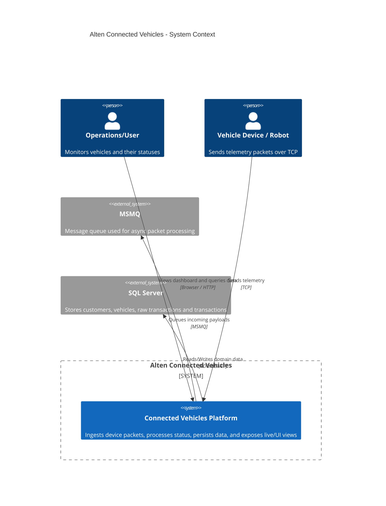
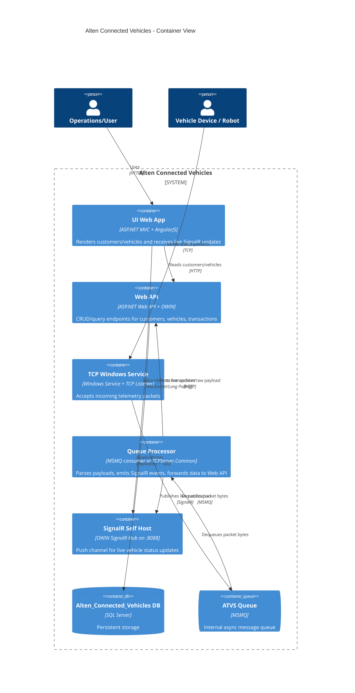
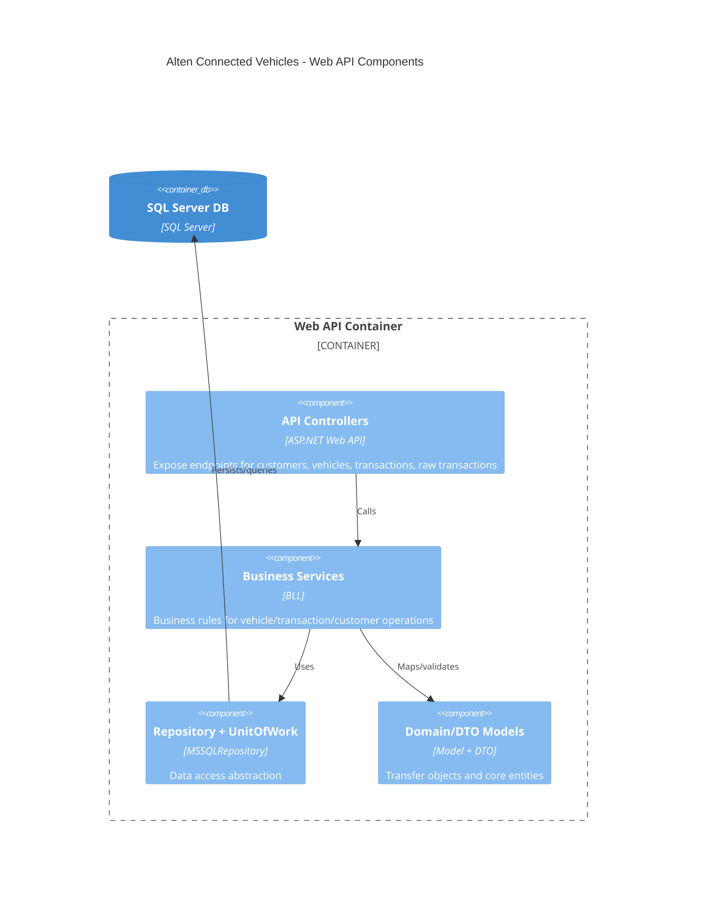

# Alten Connected Vehicles — C4 Architecture

This document provides a C4-style view (Context, Container, and Component) of the current solution.

## 1) System Context (C4 Level 1)

## 2) Container Diagram (C4 Level 2)

## 3) Component Diagram for Web API (C4 Level 3)

## Key Runtime Flow

1. A device (or the robot simulator) sends a packet to the TCP Windows Service.
2. The service pushes raw bytes to MSMQ (`ATVS` private queue).
3. MSMQ consumer parses packet data (registration + status), then:
   - publishes real-time status via SignalR hub,
   - posts transaction/raw data to the Web API.
4. Web API executes BLL logic and repository operations to persist transaction and update vehicle status.
5. UI fetches baseline customer/vehicle data from Web API and receives live status changes from SignalR.
